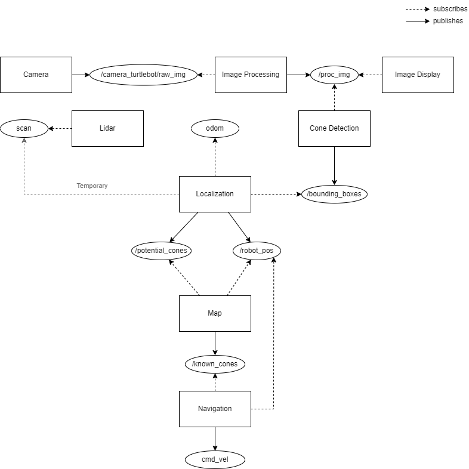

# Autonomous Driving Turtlebot3 using ROS2 Foxy
This repository contains the implementation of a self-driving Turtlebot3. The system was initially developed as a prototype for the RUB Motorsports racecar taking part in the Student Formula competition. The system layout and most important design decisions are being documented below.

## Layout
The complete cluster of nodes and their interaction can be seen in the following overview. 

## Design Decisions

## Troubleshooting
